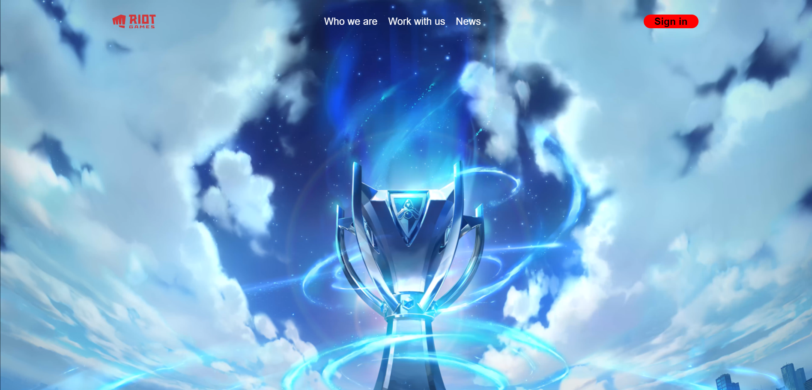

**PE2: GIT taak 2**

Verwerk de volgende vereisten zoals in de "Project Vereisten" sessie.
Maak voor elke vereiste een commit in je eigen repository. Voor elke commit vermeld je het vernoemde ID (NAV-01, enz.) in de commit message.


Gevraagd: Bouw de volgende webpagina na:



Requirements:

| &nbsp;&nbsp;&nbsp;&nbsp;&nbsp;&nbsp;ID&nbsp;&nbsp;&nbsp;&nbsp;&nbsp;&nbsp;&nbsp; | Onderwerp                  | Beschrijving                                                                                                                                                                                                                                                                                                                                                                                                                  |
|----------------------------------------------------------------------------------|----------------------------|-------------------------------------------------------------------------------------------------------------------------------------------------------------------------------------------------------------------------------------------------------------------------------------------------------------------------------------------------------------------------------------------------------------------------------|
| NAV-01                                                                           | Main structuur             | Maak een navigatie-element aan met 3 structuur-elementen erin. Elk structuurelement moet een derde van de nav breed zijn en ze moeten alle 3 naast elkaar komen te staan.                                                                                                                                                                                                                                                     |
| NAV-02                                                                           | Afbeelding                 | In de linkse container van de nav komt het logo van Riot games                                                                                                                                                                                                                                                                                                                                                                |
| NAV-03                                                                           | Middelste deel + opmaak    | Plaats in het middelste structuurelement een ul. Binnen deze lijst plaats je de 3 linken.<br/>Elke link krijgt een witte tekstkleur, <br/>een lettergrootte van 14pt<br/>de opsommingstekens moeten via css verwijderd worden<br/><br/>Zoek zelf uit hoe je met flexbox de list-items naast elkaar kunt krijgen i.p.v. onder elkaar. En hoe je de elementen in de 3 containers (links,midden,rechts) centraal kunt centreren. |
| NAV-04                                                                           | Rechtse deel               | Voeg in het rechtse structuurelement een link toe die je opmaakt zoals op de afbeelding te zien is.<br/>TIP: Zoek op hoe je de randen van het element ronder kunt maken om de ovale shape te bekomen.                                                                                                                                                                                                                         |
| HEADER-01                                                                        | Video en afwerking styling | Maak een header-element aan en plaats de nav en de video (zie code hier beneden) in de header.<br/>Zorg ervoor dat jouw resultaat zoveel mogelijk lijkt op de screenshot.<br/>TIP: De css-properties **position** en **z-index** kunnen je helpen om de nav over de video te krijgen                                                                                                                                          |


Code voor de video:

````html
<video class="hero_new__video" autoplay="" playsinline=""
           poster="https://www.riotgames.com/darkroom/1920/f277926f65f932fad572f88b04d57c4b:79ca86b2c1d8302b93bf04aad5f03c71/w24-riot-homepage-back-up.jpg"
           muted="" loop="" preload="auto">
        <source src="https://www.riotgames.com/darkroom/original/d2224a81b271091b06d91da597aefe0d:c18d41cc833ebc0f52c48f0f927049ac/trophystraight-effect-full.mp4"
                type="video/mp4">
    </video>
````